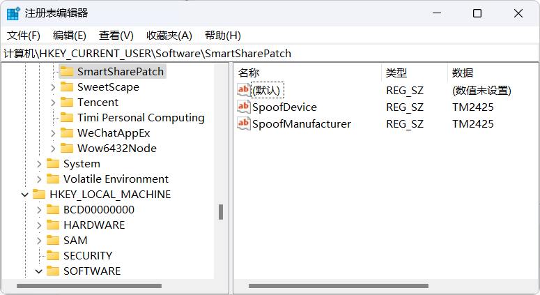

## 小米互联服务小米电脑管家非小米笔记本安装补丁及安装包历史版本

- **回家地址**
  - <https://geoisam.github.io/xiaomi>
  - <https://geoisam.pages.dev/xiaomi>

 

- **小米电脑管家注意事项**
  - 小米电脑管家若安装时仍出现 **⌜暂未支持本设备⌟** 的提示，请检查自己的电脑是否为 `Arm架构` 或者 `x86架构` 的设备，目前所有版本均只支持 Windows10 系统及以上版本的 `x64架构` 处理器设备
  - `wtsapi32.dll` 无法正常安装连接可以试试将注册表 `计算机\HKEY_CURRENT_USER\Software\SmartSharePatch` 的 `SpoofDevice` 字符串值改为 `TM2425` 即 REDMI Book Pro 16 2026，同理 `version.dll` 和 `msimg32.dll` 添加自定义制造商伪装，见注册表 `计算机\HKCU\Software\SmartSharePatch\SpoofManufacturer`，更多机型请自行查询 <https://www.mi.com/service/notebook/drivers>

 

- **参考资料**
  - [【ChsBuffer】小米电脑管家非小米笔记本安装补丁 【7月7日更新】](https://www.coolapk.com/feed/57307986?s=ZDI5ZTM0MGIyMWZhMDc4ZzY5YzIwZjc1ega1603)
  - [【ChsBuffer】小米电脑管家安装补丁 2026.03.24 更新](https://www.coolapk.com/feed/70856200?s=MjlmNGM0NWQxNTE4MTVkZzY5YzIwZThkega1600b3)
  - [【Mi_柒刻】小米电脑管家非小米笔记本安装补丁](https://www.coolapk.com/feed/70846944?s=ZTk1MWI1OTUxOWEwNzRnNmEwODM2NmV6a1540)
  - [【DannerTomas】在Windows10上安装小米互联服务](https://www.coolapk.com/feed/70392493?s=OTFiYWNlMjYyMWZhMDc4ZzZhMjJkNDUzega1623)

 

- **安装包及补丁** `完全免费`
  - **百度网盘** `龟速`
    - <https://pan.baidu.com/s/5_aFchUTxMhmLe6OaQ9BYdQ>
  - **阿里云盘** `慢速`
    - <https://www.alipan.com/s/GLicweKYL47>
  - **天翼云盘** `快速`
    - <https://cloud.189.cn/t/y2QNryq2Y3me>
  - **小飞机网盘** `极速`
    - <https://share.feijipan.com/s/5r5oaCLy>

 

### \# 赞赏码（在线乞讨）

<table>
<tr>
<td></td>
<td></td>
</tr>
</table>